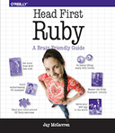

```
Roberto Nogueira  BSd EE, MSd CE
Solution Integrator Experienced - Certified by Ericsson
```

# Head First Ruby



## Table of Contents

```
Head First Ruby

Table of Contents

Chapter 1 Code the way you want
[x] xhe Ruby philosophy
[x] Get Ruby
[x] Use Ruby
[x] Use Ruby—interactively
[x] Your first Ruby expressions
[x] Math operations and comparisons
[x] Strings
[x] Variables
[x] Everything is an object!
[x] Calling a method on an object
[x] Let’s build a game
[x] Input, storage, and output
[x] Running scripts
[ ] Comments
[ ] “puts” and “print”
[ ] Method arguments
[ ] “gets”
[ ] Parentheses are optional on method calls
[ ] String interpolation
[ ] What’s in that string?
[ ] Inspecting objects with the “inspect” and “p” methods
[ ] Escape sequences in strings
[ ] Calling “chomp” on the string object
[ ] What methods are available on an object?
[ ] Generating a random number
[ ] Converting to strings
[ ] Ruby makes working with strings easy
[ ] Converting strings to numbers
[ ] Conditionals
[ ] The opposite of “if” is “unless”
[ ] Loops
[ ] Let’s try running our game!
[ ] Your Ruby Toolbox
[ ] Up Next...

Chapter 2 Methods and Classes: Getting Organized
[ ] Defining methods
[ ] Calling methods you’ve defined
[ ] Method names
[ ] Parameters
[ ] Optional parameters
[ ] Return values
[ ] Returning from a method early
[ ] Some messy methods
[ ] Too many arguments
[ ] Too many “if” statements
[ ] Designing a class
[ ] What’s the difference between a class and an object?
[ ] Your first class
[ ] Creating new instances (objects)
[ ] Breaking up our giant methods into classes
[ ] Creating instances of our new animal classes
[ ] Updating our class diagram with instance methods
[ ] Our objects don’t “know” their names or ages!
[ ] Too many arguments (again)
[ ] Local variables live until the method ends
[ ] Instance variables live as long as the instance does
[ ] Encapsulation
[ ] Attribute accessor methods
[ ] Using accessor methods
[ ] Attribute writers and readers
[ ] Attribute writers and readers in action
[ ] Ensuring data is valid with accessors
[ ] Errors—the “emergency stop” button
[ ] Using “raise” in our attribute writer methods
[ ] Our complete Dog class
[ ] Your Ruby Toolbox
[ ] Up Next...

Chapter 3 Inheritance: Relying on Your Parents
[ ] Copy, paste... Such a waste...
[ ] Mike’s code for the virtual test-drive classes
[ ] Inheritance to the rescue!
[ ] Defining a superclass (requires nothing special)
[ ] Defining a subclass (is really easy)
[ ] Adding methods to subclasses
[ ] Subclasses keep inherited methods alongside new ones
[ ] Instance variables belong to the object, not the class!
[ ] Overriding methods
[ ] Bringing our animal classes up to date with inheritance
[ ] Designing the animal class hierarchy
[ ] Code for the Animal class and its subclasses
[ ] Overriding a method in the Animal subclasses
[ ] We need to get at the overridden method!
[ ] The “super” keyword
[ ] A super-powered subclass
[ ] Difficulties displaying Dogs
[ ] The Object class
[ ] Why everything inherits from the Object class
[ ] Overriding the inherited method
[ ] Your Ruby Toolbox
[ ] Up Next...

Chapter 4 Initializing Instances: Off to a Great Start
[ ] Payroll at Chargemore
[ ] An Employee class
[ ] Creating new Employee instances
[ ] A division problem
[ ] Division with Ruby’s Fixnum class
[ ] Division with Ruby’s Float class
[ ] Fixing the salary rounding error in Employee
[ ] Formatting numbers for printing
[ ] Format sequences
[ ] Format sequence types
[ ] Format sequence width
[ ] Format sequence width with floating-point numbers
[ ] Using “format” to fix our pay stubs
[ ] When we forget to set an object’s attributes...
[ ] “nil” stands for nothing
[ ] “/” is a method
[ ] The “initialize” method
[ ] Employee safety with “initialize”
[ ] Arguments to “initialize”
[ ] Using optional parameters with “initialize”
[ ] “initialize” does an end-run around our validation
[ ] “initialize” and validation
[ ] Call other methods on the same instance with “self”
[ ] When “self” is optional
[ ] Implementing hourly employees through inheritance
[ ] Restoring “initialize” methods
[ ] Inheritance and “initialize”
[ ] “super” and “initialize”
[ ] Same class, same attribute values
[ ] An inefficient factory method
[ ] Class methods
[ ] Our complete source code
[ ] Your Ruby Toolbox
[ ] Up Next...

Chapter 5 Arrays and Blocks: Better Than Loops
[ ] Arrays
[ ] Accessing arrays
[ ] Arrays are objects, too!
[ ] Looping over the items in an array
[ ] The repeating loop
[ ] Eliminating repetition...the WRONG way...
[ ] Chunks of code?
[ ] Blocks
[ ] Defining a method that takes blocks
[ ] Your first block
[ ] Flow of control between a method and block
[ ] Calling the same method with different blocks
[ ] Calling a block multiple times
[ ] Block parameters
[ ] Using the “yield” keyword
[ ] Block formats
[ ] The “each” method
[ ] The “each” method, step-by-step
[ ] DRYing up our code with “each” and blocks
[ ] Blocks and variable scope
[ ] Using “each” with the “refund” method
[ ] Using “each” with our last method
[ ] Our complete invoicing methods
[ ] We’ve gotten rid of the repetitive loop code!
[ ] Utilities and appliances, blocks and methods
[ ] Your Ruby Toolbox
[ ] Up Next...

Chapter 6 Block Return Values: How Should I Handle This?
[ ] A big collection of words to search through
[ ] Opening the file
[ ] Safely closing the file
[ ] Safely closing the file, with a block
[ ] Don’t forget about variable scope!
[ ] Finding array elements we want, with a block
[ ] The verbose way to find array elements, using “each”
[ ] Introducing a faster method...
[ ] Blocks have a return value
[ ] How the method uses a block return value
[ ] Putting it all together
[ ] A closer look at the block return values
[ ] Eliminating elements we don’t want, with a block
[ ] The return values for “reject”
[ ] Breaking a string into an array of words
[ ] Finding the index of an array element
[ ] Making one array that’s based on another, the hard way
[ ] Making one array based on another, using “map”
[ ] Some additional logic in the “map” block body
[ ] The finished product
[ ] Your Ruby Toolbox
[ ] Up Next...

Chapter 7 Hashes: Labeling Data
[ ] Counting votes
[ ] An array of arrays...is not ideal
[ ] Hashes
[ ] Hashes are objects
[ ] Hashes return “nil” by default
[ ] nil (and only nil) is “falsy”
[ ] Returning something other than “nil” by default
[ ] Normalizing hash keys
[ ] Hashes and “each”
[ ] A mess of method arguments
[ ] Using hashes as method parameters
[ ] Hash parameters in our Candidate class
[ ] Leave off the braces!
[ ] Leave out the arrows!
[ ] Making the entire hash optional
[ ] Typos in hash arguments are dangerous
[ ] Keyword arguments
[ ] Using keyword arguments with our Candidate class
[ ] Required keyword arguments
[ ] Your Ruby Toolbox
[ ] Up Next...

Chapter 8 References: Crossed Signals
[ ] Some confusing bugs
[ ] The heap
[ ] References
[ ] When references go wrong
[ ] Aliasing
[ ] Fixing the astronomer’s program
[ ] Quickly identifying objects with “inspect”
[ ] Problems with a hash default object
[ ] We’re actually modifying the hash default object!
[ ] A more detailed look at hash default objects
[ ] Back to the hash of planets and moons
[ ] Our wish list for hash defaults
[ ] Hash default blocks
[ ] Hash default blocks: Assigning to the hash
[ ] Hash default blocks: Block return value
[ ] Hash default blocks: A shortcut
[ ] The astronomer’s hash: Our final code
[ ] Using hash default objects safely
[ ] Hash default object rule #1: Don’t modify the default object
[ ] Hash default object rule #2: Assign values to the hash
[ ] The rule of thumb for hash defaults
[ ] Your Ruby Toolbox
[ ] Up Next...

Chapter 9 Mixins: Mix It Up
[ ] The media-sharing app
[ ] The media-sharing app...using inheritance
[ ] One of these classes is not (quite) like the others
[ ] Option one: Make Photo a subclass of Clip
[ ] Option two: Copy the methods you want into the Photo class
[ ] Not an option: Multiple inheritance
[ ] Using modules as mixins
[ ] Mixins, behind the scenes
[ ] Creating a mixin for comments
[ ] Using our comments mixin
[ ] A closer look at the revised “comments” method
[ ] Why you shouldn’t add “initialize” to a mixin
[ ] Mixins and method overriding
[ ] Avoid using “initialize” methods in modules
[ ] Using the Boolean “or” operator for assignment
[ ] The conditional assignment operator
[ ] Our complete code
[ ] Your Ruby Toolbox
[ ] Up Next...

Chapter 10 Comparable and Enumerable: Ready-Made Mixes
[ ] Mixins built into Ruby
[ ] A preview of the Comparable mixin
[ ] Choice (of) beef
[ ] Implementing a greater-than method on the Steak class
[ ] Constants
[ ] We have a lot more methods to define...
[ ] The Comparable mixin
[ ] The spaceship operator
[ ] Implementing the spaceship operator on Steak
[ ] Mixing Comparable into Steak
[ ] How the Comparable methods work
[ ] Our next mixin
[ ] The Enumerable module
[ ] A class to mix Enumerable into
[ ] Mixing Enumerable into our class
[ ] Inside the Enumerable module
[ ] Your Ruby Toolbox
[ ] Up Next...

Chapter 11 Documentation: Read the Manual
[ ] Learning how to learn more
[ ] Ruby’s core classes and modules
[ ] Documentation
[ ] HTML documentation
[ ] Listing available classes and modules
[ ] Looking up instance methods
[ ] Instance methods denoted with # in the docs
[ ] Instance method documentation
[ ] Arguments in call signatures
[ ] Blocks in call signatures
[ ] Read the docs for the superclass and mixins, too!
[ ] Read the docs for the superclass and mixins, too! (continued)
[ ] Pool Puzzle
[ ] Pool Puzzle Solution
[ ] Looking up class methods
[ ] Class method documentation
[ ] Docs for a class that doesn’t exist?!
[ ] The Ruby standard library
[ ] Looking up classes and modules in the standard library
[ ] Where Ruby docs come from: rdoc
[ ] What rdoc can deduce about your classes
[ ] Adding your own documentation, with comments
[ ] The “initialize” instance method appears as the “new” class method
[ ] Your Ruby Toolbox
[ ] Up Next...

Chapter 12 Exceptions: Handling the Unexpected
[ ] Don’t use method return values for error messages
[ ] Using “raise” to report errors
[ ] Using “raise” by itself creates new problems
[ ] Exceptions: When something’s gone wrong
[ ] Rescue clauses: A chance to fix the problem
[ ] Ruby’s search for a rescue clause
[ ] Using a rescue clause with our SmallOven class
[ ] We need a description of the problem from its source
[ ] Exception messages
[ ] Our code so far...
[ ] Different rescue logic for different exceptions
[ ] Exception classes
[ ] Specifying exception class for a rescue clause
[ ] Multiple rescue clauses in one begin/end block
[ ] Updating our oven code with custom exception classes
[ ] Trying again after an error with “retry”
[ ] Updating our oven code with “retry”
[ ] Things you want to do no matter what
[ ] The ensure clause
[ ] Ensuring the oven gets turned off
[ ] Your Ruby Toolbox
[ ] Up Next...

Chapter 13 Unit Testing: Code Quality Assurance
[ ] Automated tests find your bugs before someone else does
[ ] A program we should have had automated tests for
[ ] Types of automated tests
[ ] MiniTest: Ruby’s standard unit-testing library
[ ] Running a test
[ ] Testing a class
[ ] A closer look at the test code
[ ] Red, green, refactor
[ ] Tests for ListWithCommas
[ ] Getting the test to pass
[ ] Another bug to fix
[ ] Test failure messages
[ ] A better way to assert that two values are equal
[ ] Some other assertion methods
[ ] Removing duplicated code from your tests
[ ] The “setup” method
[ ] The “teardown” method
[ ] Updating our code to use the “setup” method
[ ] Your Ruby Toolbox
[ ] Up Next...

Chapter 14 Web Apps: Serving HTML
[ ] Writing web apps in Ruby
[ ] Our task list
[ ] Project directory structure
[ ] Browsers, requests, servers, and responses
[ ] Sinatra takes requests
[ ] Downloading and installing libraries with RubyGems
[ ] Installing the Sinatra gem
[ ] A simple Sinatra app
[ ] Your computer is talking to itself
[ ] Request type
[ ] Resource path
[ ] Sinatra routes
[ ] Multiple routes in the same Sinatra app
[ ] A route for the list of movies
[ ] Making a movie list in HTML
[ ] Accessing the HTML from Sinatra
[ ] A class to hold our movie data
[ ] Setting up a Movie object in the Sinatra app
[ ] ERB embedding tags
[ ] The ERB output embedding tag
[ ] Embedding a movie title in our HTML
[ ] Pool Puzzle
[ ] Pool Puzzle Solution
[ ] The regular embedding tag
[ ] Looping over several movie titles in our HTML
[ ] Letting users add data with HTML forms
[ ] Getting an HTML form for adding a movie
[ ] HTML tables
[ ] Cleaning up our form with an HTML table
[ ] There’s still more to do
[ ] Your Ruby Toolbox
[ ] Up Next...

Chapter 15 Saving and Loading Data: Keep It Around
[ ] Saving and retrieving form data
[ ] Our browser can GET the form...
[ ] ... But it needs to POST the response
[ ] Setting the HTML form to send a POST request
[ ] Setting up a Sinatra route for a POST request
[ ] Converting objects to and from strings with YAML
[ ] Saving objects to a file with YAML::Store
[ ] Saving movies to a file with YAML::Store
[ ] A system for finding Movies in the YAML::Store
[ ] Numeric IDs for Movies
[ ] Finding the next available movie ID
[ ] A class to manage our YAML::Store
[ ] Using our MovieStore class in the Sinatra app
[ ] Testing the MovieStore
[ ] Loading all movies from the MovieStore
[ ] Loading all movies from the MovieStore (continued)
[ ] Loading all movies in the Sinatra app
[ ] Building HTML links to individual movies
[ ] Building HTML links to individual movies (continued)
[ ] Named parameters in Sinatra routes
[ ] Using a named parameter to get a movie’s ID
[ ] Defining routes in order of priority
[ ] Finding a Movie in the YAML::Store
[ ] An ERB template for an individual movie
[ ] Finishing the Sinatra route for individual movies
[ ] Let’s try it all out!
[ ] Our complete app code
[ ] Your Ruby Toolbox
[ ] Up Next... 

Appendix Leftovers: The top ten topics (we didn’t cover)
[ ] #1 Other cool libraries
[ ] #2 Inline if and unless
[ ] #3 Private methods
[ ] #4 Command-line arguments
[ ] #5 Regular expressions
[ ] #6 Singleton methods
[ ] #7 Call any method, even undefined ones
[ ] #7 Call any method, even undefined ones (continued)
[ ] #8 Automating tasks with Rake
[ ] #9 Bundler
[ ] #10 Other books
[ ] Appendix This isn’t goodbye
[ ] Appendix O’reilly®: Ruby
```
